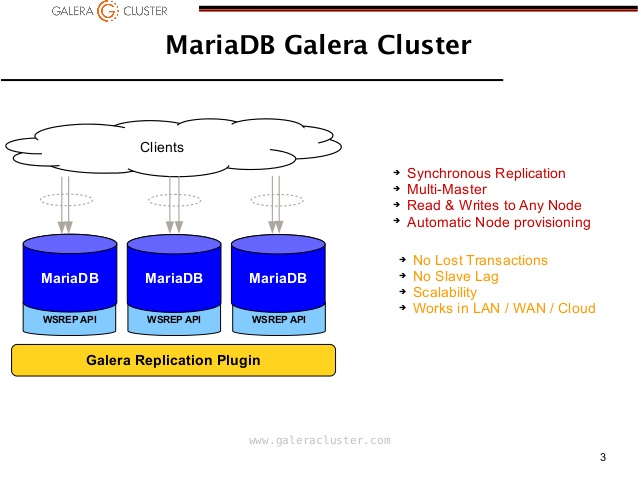
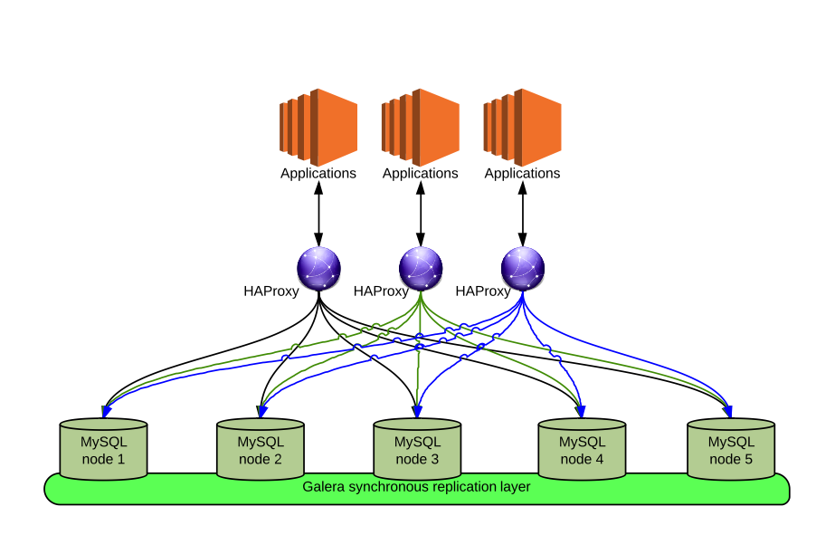

# MariaDB Galera Cluster Deploy Playbook

---

- Author      : 紫川秀
- Email       : yumaojun03@gmail.com
- Date        : 2015-10-21
- Description : 用于部署MariaDB Galera Cluster

---

### Roles 简介

> common

该role用于 初始化整个 MariaDB Galera Cluster 环境，
主要是做一些 每个集群节点都需要做的通用操作

> galera

整个galera集群没有主从概念，整体的被看做一个副本集，所有节点 关系对等。
该role用于 执行安装 MariaDB Galera Cluster
主要是做 集群安装、集群配置、集群启动 等操作

> hypervisor

主要用于操作 vcenter 生成所需的 虚拟机

---

### Galera 简介

---

### Galera 使用场景

---

